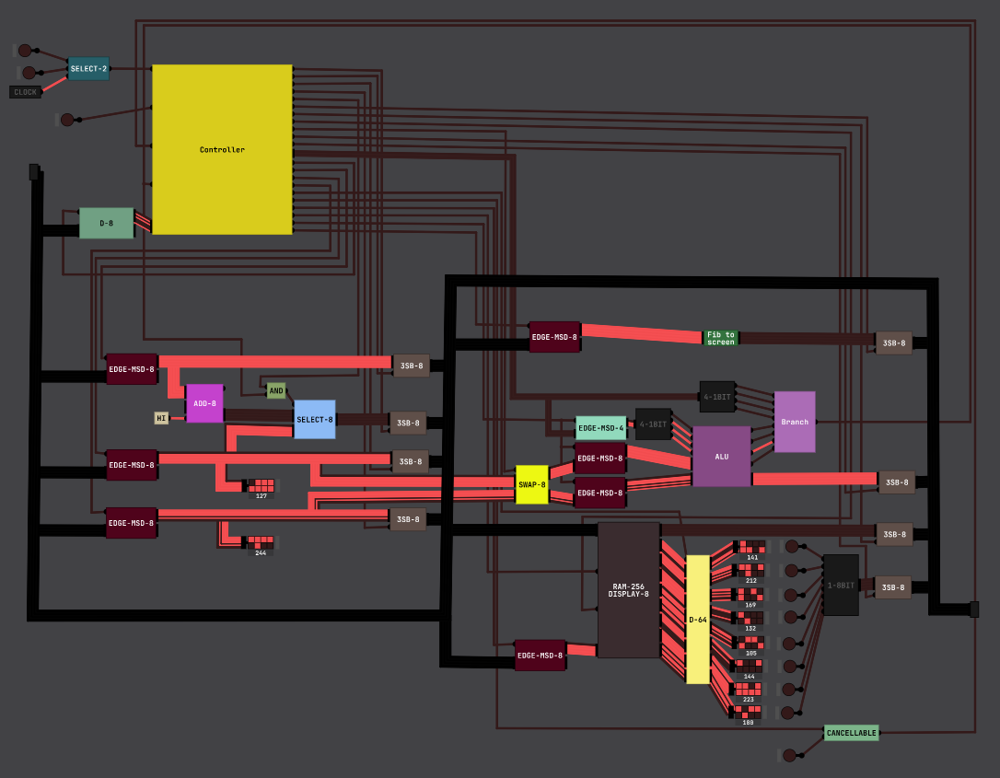
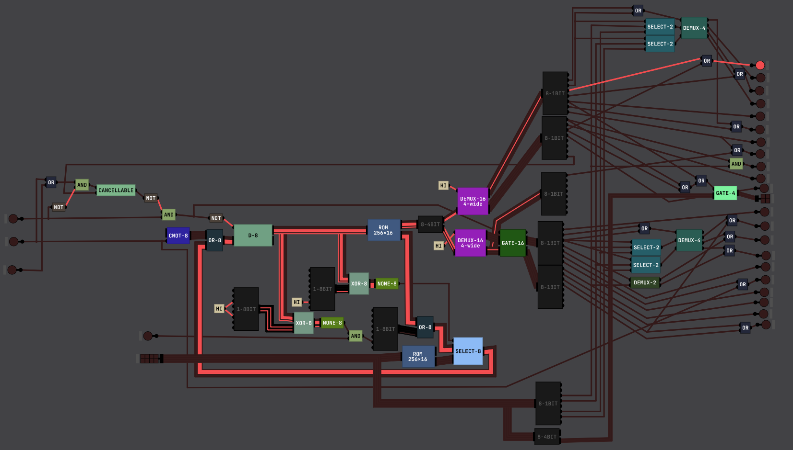
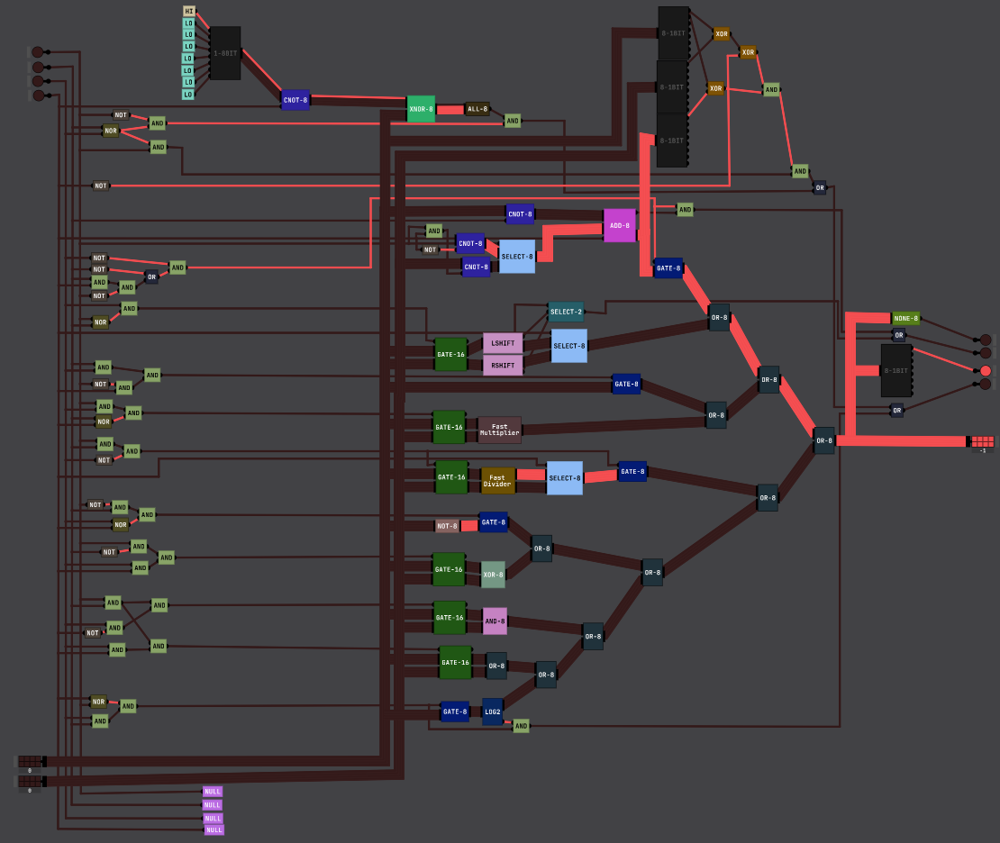

# TP1 Machine

This repo contains:

+ A simulator of the TP1 machine for [Digital Logic Sim](https://sebastian.itch.io/digital-logic-sim) version 2.1.6
+ Some design documentation, including the instruction set and microcode
+ An assembler for the machine
+ A VSCode language server for the TP1 Assembly language
+ Some example TP1 Assembly programs

## Screenshots

CPU

Controller

ALU
